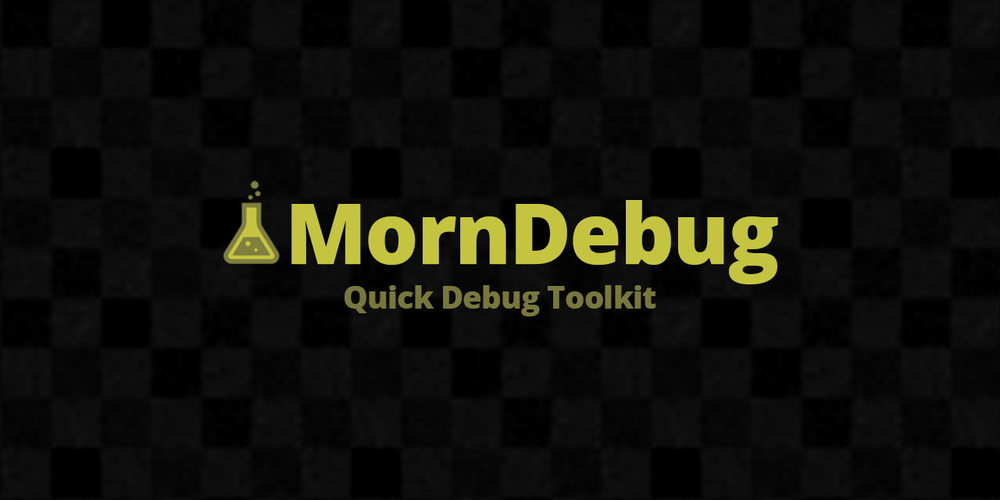

# MornDebug

<p align="center">
  
</p>

<p align="center">
  
</p>

## 概要

GUILayoutを用いたデバッグ機能を簡単に構築できる補助ツール。EditorWindow・ランタイムUIの両方に対応。

## 導入方法

Unity Package Manager で以下の Git URL を追加:

```
https://github.com/TsukumiStudio/MornDebug.git?path=src#1.0.2
```

`Window > Package Manager > + > Add package from git URL...` に貼り付けてください。

### 依存パッケージ

- [MornGlobal](https://github.com/TsukumiStudio/MornGlobal) (`com.tsukumistudio.mornglobal`)

## 使い方

### ScriptableObjectで登録

`MornDebugMenuBase` を継承してメニューを定義し、`MornDebugGlobal` の Menus に登録する。

```csharp
[CreateAssetMenu(menuName = "Morn/Debug/MyMenu")]
public sealed class MyDebugMenu : MornDebugMenuBase
{
    public override IEnumerable<(string key, Action action)> GetMenuItems()
    {
        yield return ("カスタム/ボタン", () =>
        {
            if (GUILayout.Button("実行")) { /* 処理 */ }
        });
    }
}
```

### CancellationToken で登録

トークンがキャンセルされると自動で解除される。

```csharp
MornDebugCore.RegisterGUI("FPS", () =>
{
    GUILayout.Label($"FPS: {1f / Time.deltaTime:F0}");
}, destroyCancellationToken);
```

### GameObject / MonoBehaviour で登録

オブジェクトのDestroy時に自動で解除される。

```csharp
MornDebugCore.RegisterGUI("プレイヤー/HP", () =>
{
    GUILayout.Label($"HP: {_hp}");
}, gameObject);
```

### IDisposable で登録

任意のタイミングで手動解除できる。

```csharp
var registration = MornDebugCore.RegisterGUI("一時メニュー", () =>
{
    GUILayout.Label("一時的な情報");
});

// 不要になったら解除
registration.Dispose();
```

### ランタイムUIの表示

```csharp
MornDebugUI.Show();    // 表示
MornDebugUI.Hide();    // 非表示
MornDebugUI.Toggle();  // 切り替え
```

## ビルトインメニュー

よく使うデバッグ項目をデフォルトで用意しています。`MornDebugGlobal` のInspectorから個別に作成・登録できます。

- `MornDebugSaveMenu` — PlayerPrefsリセット
- `MornDebugSoundMenu` — AudioMixerの公開パラメータ制御
- `MornDebugTimeScaleMenu` — Time.timeScaleの調整
- `MornDebugReloadMenu` — シーン再読み込み、Domain/Scene Reload
- `MornDebugSceneListMenu` — BuildSettingsのシーンツリー表示（Editor専用）

## ライセンス

[The Unlicense](LICENSE)
